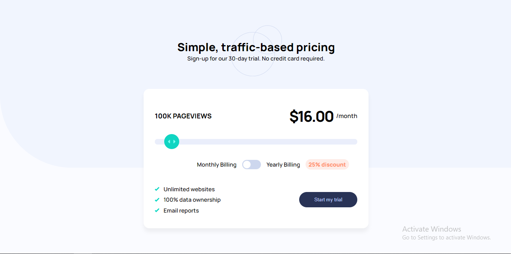

# Frontend Mentor - Interactive pricing component solution

## Table of contents

- [Overview](#overview)
  - [The challenge](#the-challenge)
  - [Screenshot](#screenshot)
- [My process](#my-process)
  - [Built with](#built-with)
  - [What I learned](#what-i-learned)
  - [Continued development](#continued-development)
  - [Useful resources](#useful-resources)
- [Author](#author)

## Overview

### The challenge

Users should be able to:

- View the optimal layout for the app depending on their device's screen size
- See hover states for all interactive elements on the page
- Use the slider and toggle to see prices for different page view numbers

### Screenshot

## My process

### Built with

- Flexbox
- CSS Grid
- Semantic HTML5 markup
- CSS custom properties
- Mobile-first workflow
- Accessibility in mind

### What I learned

### Continued development

### Useful resources

- [Smashing magazine](https://www.smashingmagazine.com/2021/12/create-custom-range-input-consistent-browsers/) - This website helped me create the custom range slider by removing the default styles.

## Author

- Website - [George Asiedu](https://www.georgeasiedu.tech)
- Frontend Mentor - [@george5-star](https://www.frontendmentor.io/profile/george5-star)
- Twitter - [@george5_star](https://www.twitter.com/george5_star)
